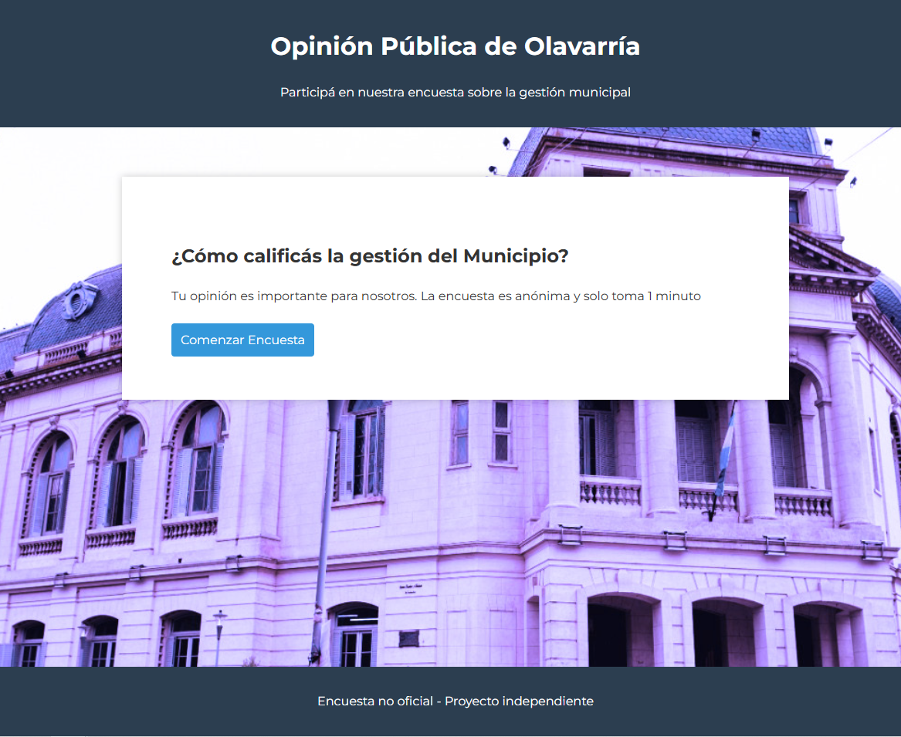
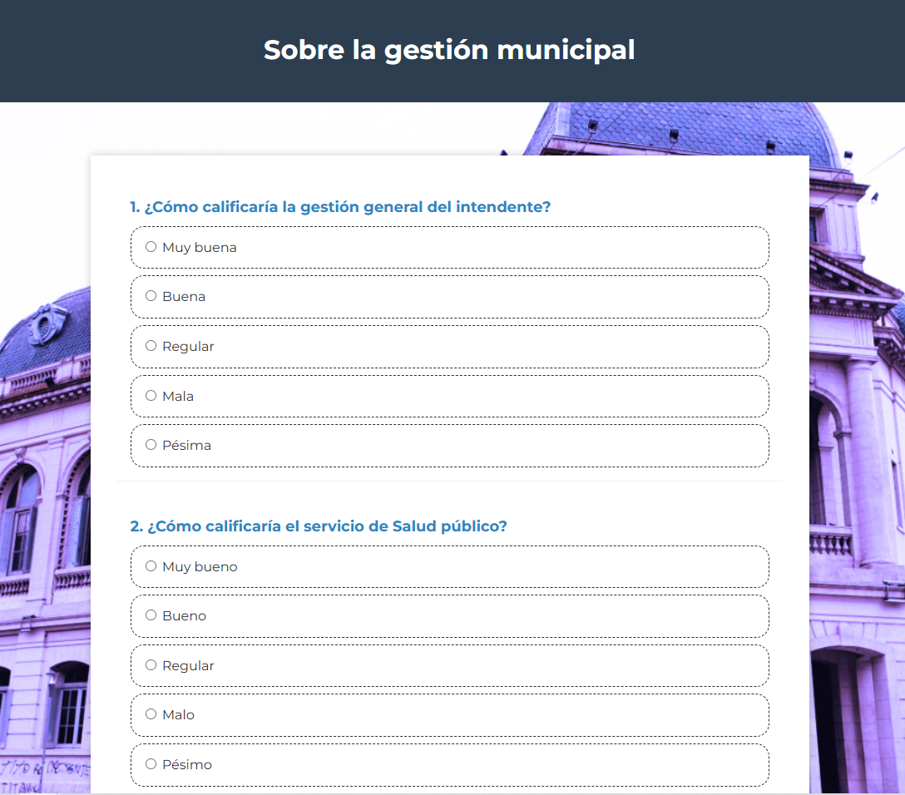
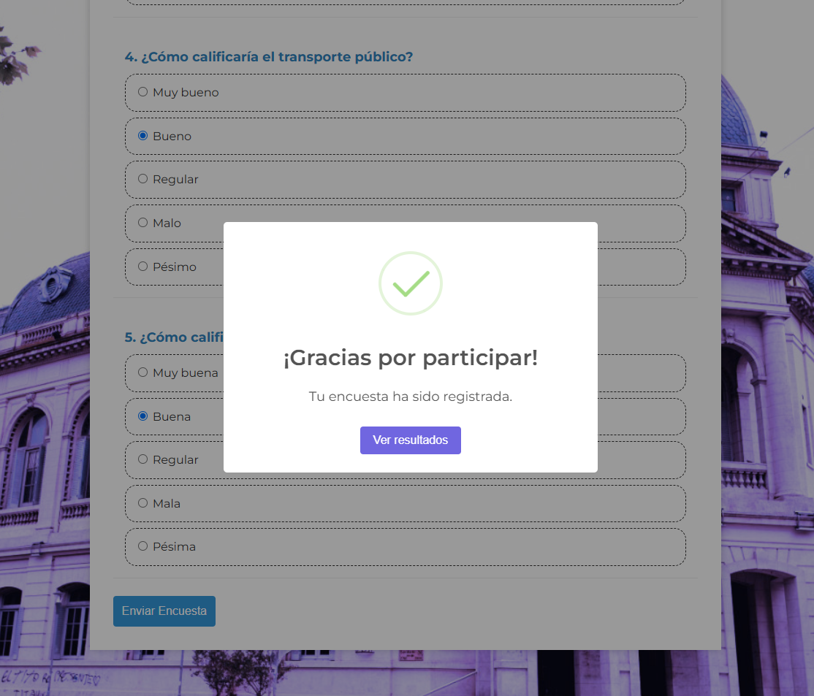
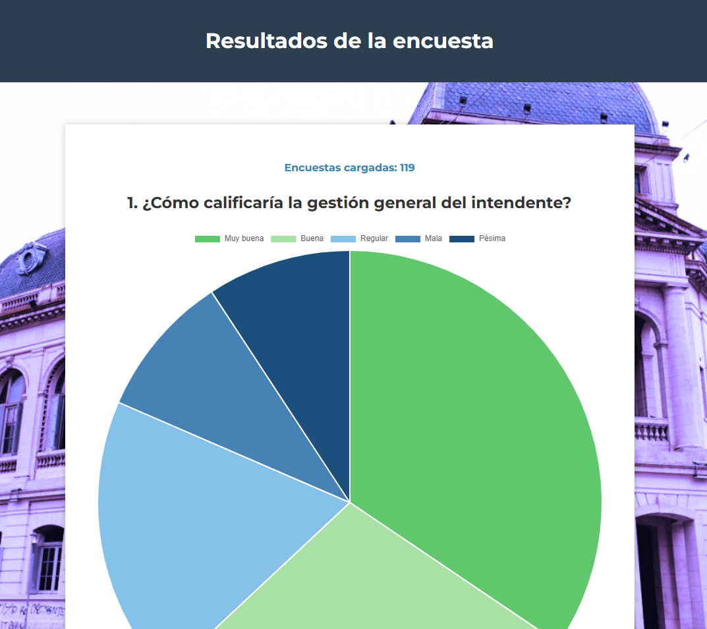

# 📋 Encuestadora Node.js + SQLite


Aplicación web de encuestas que permite recolectar respuestas de usuarios y almacenarlas en una base de datos de manera sencilla y eficiente.

---

## 🚀 Tecnologías Utilizadas

- **Frontend**: HTML5, CSS3, JavaScript
- **Backend**: Node.js, Express
- **Base de datos**: SQLite
- **Otros**: SweetAlert2 (alertas visuales)

---

## 🖼️ Capturas de Pantalla

### Página principal



### Vista encuesta



### Resultado de envío



### Resultados encuesta




---

## ⚙️ Instalación y ejecución

### 1. Clonar el repositorio

1. Clonar repositorio:
   ```bash
   git clone https://github.com/FacuDee/encuesta-node-sqlite.git
   cd encuesta-node-sqlite
   ```
